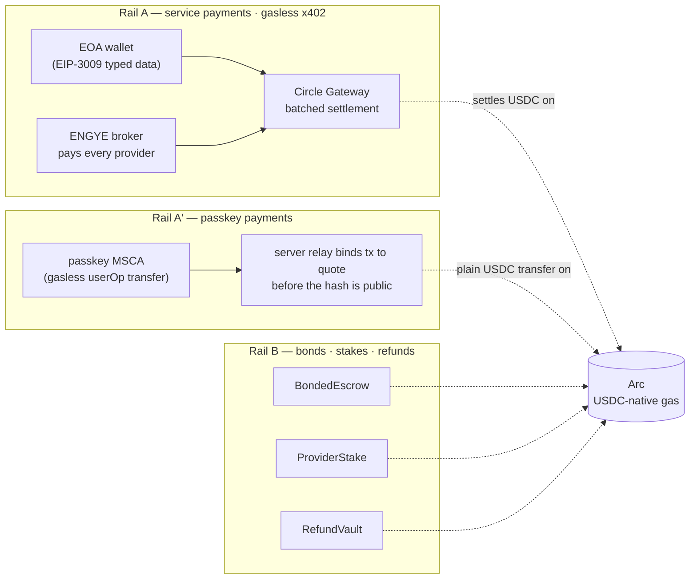
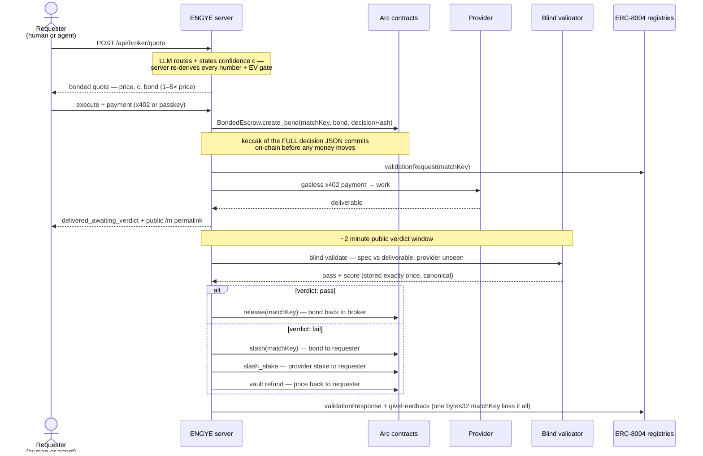
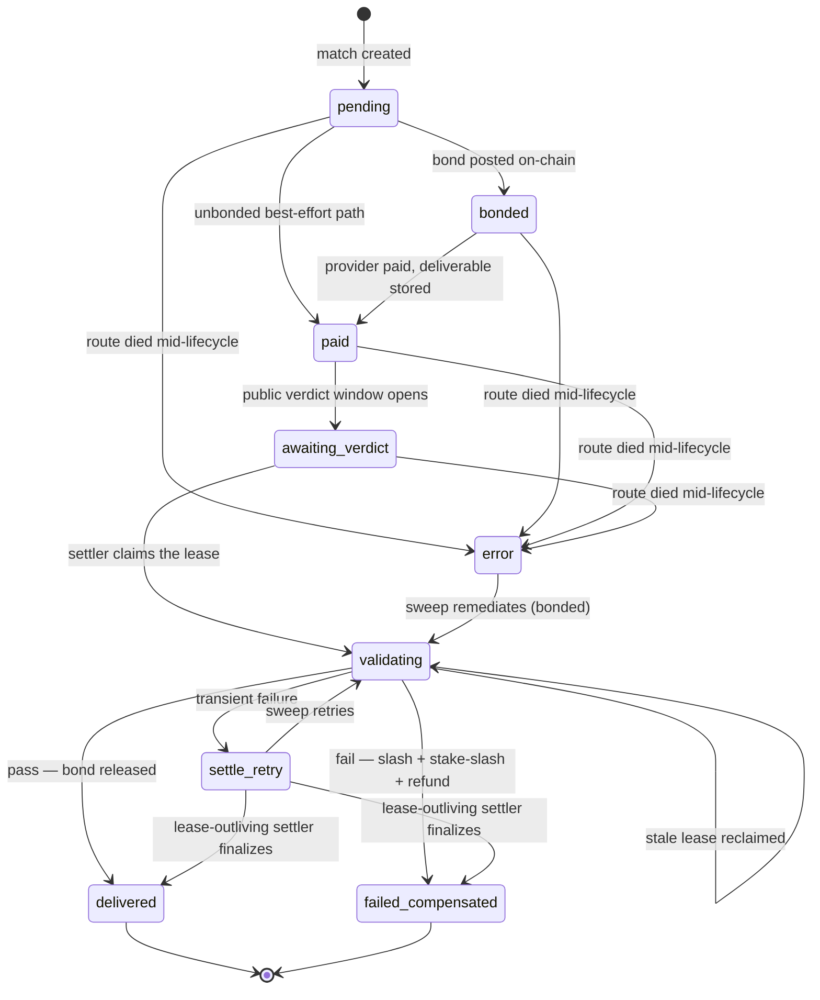
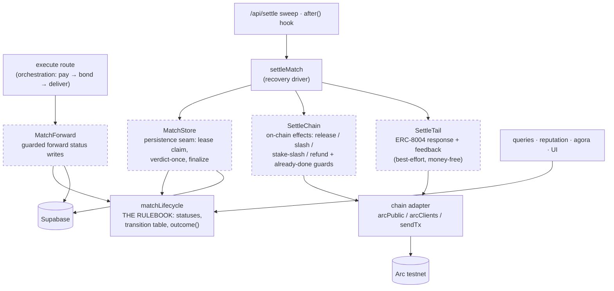

# ENGYE — architecture

How the bonded broker works, end to end: the two money rails, the life of a match, the state
machine that governs it, and the module seams that keep it testable. The judge-facing overview is
in the [README](README.md); this is the deeper map.

## The two money rails

Two USDC rails on Arc, never conflated: **Rail A** moves service payments (offchain-signed,
gasless, batch-settled by Circle Gateway), **Rail B** moves the accountability money (bonds,
stakes, refunds) through ENGYE's Vyper contracts.

*Why Rail A′ exists: a passkey has no raw private key, so it cannot sign the `ecrecover`-based
EIP-3009 authorization Gateway needs — it pays by plain transfer instead, and the server creates
the tx↔quote binding before the hash is ever public, closing rebind/replay attacks.*

## The life of a match

Settlement is a **step-idempotent, resumable sweep**: any step may have already run in an attempt
that died, so every step re-derives "already done?" from on-chain state, never DB flags. A
permissionless `POST /api/settle` re-drives anything past its window, and the bond's permissionless
`claim_timeout()` is the on-chain floor beneath everything.

## The match state machine

This diagram is generated from the single source of truth — the `TRANSITIONS` table in
[`lib/matchLifecycle.ts`](lib/matchLifecycle.ts). Every status write in the codebase is a guarded
compare-and-set (`UPDATE … WHERE status IN legalFroms(to)`), so an edge that isn't drawn here
**cannot happen** in the database.

The overloaded terminal — DB `delivered` means both *bonded verdict-pass* and *unbonded handover* —
is disambiguated in exactly one function, `outcome()`, which every reader uses.

## Module seams

The money path is built around four injectable seams, so the settlement engine is unit-tested with
fakes (no chain, no DB, no LLM) and runs live with the defaults:

## Invariants worth knowing

- **Decision hash before money** — the broker's full decision JSON is committed on-chain in the same
  tx that locks the bond; the reasoning behind every dollar is tamper-evident.
- **Verdict exactly once** — a unique index + insert-then-reread means no settler ever proceeds on an
  unpersisted verdict; once money moves, the verdict can never be recomputed.
- **On-chain state decides "already done"** — resume-after-death guards read the contracts
  (`bond.status`, `slashed_for`, `refunded`), never revert-message strings or DB flags.
- **Post-money writes never abort a delivery** — persistence hiccups degrade to the recovery sweep;
  illegal status jumps are refused at the database and logged.
- **`claim_timeout()` is the floor** — if every server process dies, the requester can still recover
  the bond permissionlessly after the deadline.

## Stack

Next.js 16 (App Router) · Bun · [eve](https://www.npmjs.com/package/eve) (chat transport for
`/hire`) · Supabase (persistence + realtime) · viem · Vyper 0.4.3 + Foundry · Groq (per-role
models, server-re-derived outputs). Contract addresses: see the
[README's deployed-contracts table](README.md#deployed-contracts-all-verified-on-arcscan).
