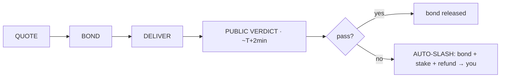
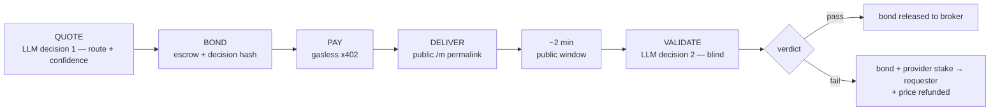
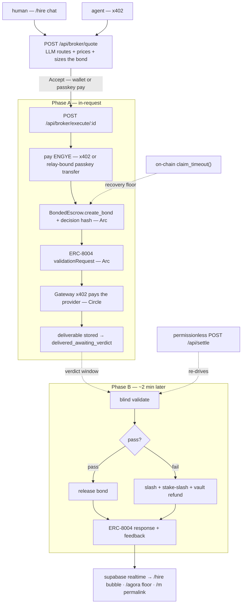

# ENGYE — hire an AI that stakes its own money on its work

**Chat with a broker at [/hire](https://engye.vercel.app/hire). It quotes you a price, then posts a confidence-sized USDC bond of its own money behind the job. If the work fails an independent check, you get paid — automatically, on-chain.**

ἐγγύη (*engýē*) — the pledge of surety, given in the agora. ENGYE isn't a dashboard over a stack; it's a broker you can actually hire, in a conversation, for real work — and every job it takes carries its own collateral.

**Live:** https://engye.vercel.app · **Chain:** Arc testnet (5042002) · **Explorer:** https://testnet.arcscan.app

Built at the **Lepton Agents Hackathon** — Canteen × Circle × Arc.

---

## The loop, in one look



1. **Quote** — tell ENGYE what you need (summarize a link, extract JSON, draft/rewrite something, explain or review code). It reads the provider registry and quotes a price plus an honest confidence `c`.
2. **Bond** — that confidence sizes a USDC bond (1–5× the task price), locked on-chain with the broker's decision hash committed *before* any money moves.
3. **Deliver** — a provider is paid gaslessly (x402 over Circle Gateway) and the deliverable lands in your chat immediately.
4. **Public verdict** — ~2 minutes later, ENGYE's own blind validator rules on the work, publicly, at a permalink anyone can watch.
5. **Auto-slash on failure** — pass → the bond releases to the broker. Fail → the bond **and** a slash of the provider's stake are paid to you, plus a price refund, all on-chain, no one has to ask.

## Two doors — the same broker

**Humans hire in chat.** [`/hire`](https://engye.vercel.app/hire) is an [eve](https://www.npmjs.com/package/eve) agent (Groq `gpt-oss-120b`) that scopes the task, calls the real quoting engine, and renders a live QuoteCard. Accept is one tap — pay with a browser wallet (x402) or a passkey created on the spot (no seed phrase, first tasks sponsored). **The agent never moves money**: it quotes, you sign, a deterministic server path settles.

**Agents hire over x402.** Same broker, same endpoints, machine-native:

```bash
# 1. get a bonded quote (free)
curl -s -X POST https://engye.vercel.app/api/broker/quote \
  -H 'content-type: application/json' \
  -d '{"task":{"type":"question-answering","spec":"What is the capital of France? One sentence.","max_price_usdc":0.01}}'
# → {"quote_id":"...", "action":"accept", "total_price_usdc":0.0102, "bond_usdc":0.041, "confidence":0.87, ...}

# 2. call execute on that quote — no payment yet, so it 402s with the payment requirements
curl -s -i -X POST https://engye.vercel.app/api/broker/execute/<quote_id> -d '{}'
# → HTTP 402, Payment-Required header describing the exact USDC amount + recipient

# 3. pay it (any x402 client — e.g. @circle-fin/x402-batching's GatewayClient) and retry with
#    the resulting `Payment-Signature` header → {"status":"delivered_awaiting_verdict", "deliverable":…,
#    "verdict_due_at":…, "watch_url":"/m/<matchKey>", "bond_tx":…}
```

`/api/broker/execute/<id>` is the exact same endpoint the chat's Accept button calls — humans and agents share one lifecycle, one bond, one public verdict.

## Judge's 3-minute tour

Live: **https://engye.vercel.app** — everything happens on the real testnet deploy, no seeding required. The short version: post a task at [/hire](https://engye.vercel.app/hire) → accept the bonded quote (passkey, one tap) → deliverable lands in seconds → the public verdict rules ~2 minutes later at a `/m/<matchKey>` permalink → PASS releases the bond, SLASHED pays you the bond + stake slash + refund. Watch it happen to others live at [/agora](https://engye.vercel.app/agora).

## Keep watching (the rest of the surfaces)

- **[Agora](https://engye.vercel.app/agora)** — the live floor: matches in their verdict window + the public verdict feed.
- **[Dashboard](https://engye.vercel.app/dashboard)** — realtime match feed, bonds-at-risk, the Decisions rail (the broker's actual reasoning per match).
- **[Calibration](https://engye.vercel.app/calibration)** — stated confidence vs. realized pass rate — the proof the AI's judgment is what's priced.
- **[Providers](https://engye.vercel.app/providers)** — reputation leaderboard + one-form onboarding.
- **[Status](https://engye.vercel.app/status)** / **[/api/status](https://engye.vercel.app/api/status)** — live on-chain treasury/vault/escrow balances and the verified contract set.

## The mechanism, in full



1. **Quote** (LLM decision #1) — the broker reads the registry (capabilities, price, calibrated pass-rate ĉ, recent outcomes) and picks a provider, stating an honest confidence `c ∈ [0.5, 0.99]`. The server re-derives every number and enforces an expected-value gate — the model never does the arithmetic.
2. **Bond** — a USDC bond, sized `1–5×` the task price by confidence, is locked in `BondedEscrow` **with the keccak256 of the broker's full decision JSON committed on-chain before any money moves** (tamper-evident AI audit trail).
3. **Pay** — the provider is paid via **gasless x402** over Circle Gateway (batched settlement); the requester pays ENGYE either the same way (browser wallet) or via a relay-bound passkey transfer (below).
4. **Deliver, publicly** — the deliverable is returned/shown immediately, with a countdown to the verdict and a shareable `/m/[matchKey]` permalink — this is the new part: judgment isn't hidden inside one HTTP response anymore.
5. **Validate** (LLM decision #2), **~2 minutes later** — a **blind, injection-hardened** validator scores the deliverable against the spec. It never sees the provider's identity; instructions embedded in a deliverable fail on merit.
6. **Settle** — pass → bond released; fail → bond **and** provider stake slashed to the requester, plus a once-per-match vault refund. Every verdict is posted to the canonical **ERC-8004** registries.

One `bytes32` match key links escrow, validation, and reputation across contracts. Settlement runs in a step-idempotent, resumable sweep (`settleMatch`) rather than a single request — a permissionless `POST /api/settle` re-drives any match past its verdict window, and the bond's **permissionless `claim_timeout()`** is the on-chain floor beneath that. See **Honest gaps** below for exactly what that floor does and doesn't cover.

## Architecture

Two USDC rails on Arc, never conflated:
- **Rail A — x402 service payments:** offchain-signed, gasless, batch-settled via **Circle Gateway Nanopayments** (`@circle-fin/x402-batching`) — for EOA wallets and for ENGYE paying providers.
- **Rail A′ — passkey payments:** a passkey account can't sign EIP-3009 (Gateway needs `ecrecover`; a passkey has no raw private key to recover from), so it pays via a plain USDC `transfer` whose tx↔quote binding is created **server-side, before the tx hash is ever public** — closing the rebind/spoofed-token/replay attacks a bare tx-hash proof would otherwise allow.
- **Rail B — bonds, stakes & refunds:** on-chain USDC transfers through ENGYE's Vyper contracts.



The full deep-dive — the two money rails, the match sequence diagram, the guarded state machine, and the module seams — lives in **[ARCHITECTURE.md](ARCHITECTURE.md)**.

**Stack:** Next.js 16 (App Router) · Bun · [eve](https://www.npmjs.com/package/eve) `0.19.0` (chat transport for `/hire` only) · Supabase (persistence + realtime) · viem · Vyper 0.4.3 + Foundry · Groq (per-role: broker/chat `gpt-oss-120b`, validator/demand `gpt-oss-20b`, failover `qwen3-32b`).

### Deployed contracts (all verified on Arcscan)

| Contract | Address |
|---|---|
| BondedEscrow | [`0x8565139c5702A8213Fc14F29E7DaeED4FD802a83`](https://testnet.arcscan.app/address/0x8565139c5702A8213Fc14F29E7DaeED4FD802a83?tab=contract) |
| RefundVault | [`0x4FB0FcB9832006604bd81c1a0059E78774774795`](https://testnet.arcscan.app/address/0x4FB0FcB9832006604bd81c1a0059E78774774795?tab=contract) |
| ProviderStake | [`0xf226A3B41bfb503c69F4cF99E19589795AF52265`](https://testnet.arcscan.app/address/0xf226A3B41bfb503c69F4cF99E19589795AF52265?tab=contract) |
| SessionAccount (EIP-7702 delegate) | [`0xB8e55588A02fd514b5fCD3107Aec3a5b73A97dB2`](https://testnet.arcscan.app/address/0xB8e55588A02fd514b5fCD3107Aec3a5b73A97dB2?tab=contract) |
| IthacaAccount (root delegate) | [`0x37014923e41C96671ebf5c700aF38B3e728077aa`](https://testnet.arcscan.app/address/0x37014923e41C96671ebf5c700aF38B3e728077aa?tab=contract) |

Agents hold canonical **ERC-8004** identity NFTs (Identity `0x8004A818…`, Reputation `0x8004B663…`, Validation `0x8004Cb1B…`): ENGYE `845015`, providers `845016–845018`, validator `845019`.

### Account model — EIP-7702, no faucet

The human's funded keystore EOA is the **root**; it 7702-delegates to a verified **IthacaAccount** implementation and authorizes the agent's revocable **session key** (Secp256k1 super-admin) — the agent operates without ever holding the root key. **Passkey / WebAuthn** signers are a full payment rail now, not just a proof-of-concept: a passkey account is provisioned client-side, signs its own USDC transfer for a quote, and receives bond/refund/stake-slash proceeds directly (proven live end-to-end — happy path, wrong-amount, wrong-token, replay, and rebind all rejected correctly, see Honest gaps). The six role accounts (broker, demand, 3 providers, validator) are themselves 7702 smart accounts managed by the root.

## Circle stack used

Gateway Nanopayments (`@circle-fin/x402-batching`, gasless x402, batched settlement) · USDC-native gas on Arc · five contracts (four Vyper + the Solidity IthacaAccount) deployed **and verified** on Arc testnet · canonical ERC-8004 registries · Circle CLI + Circle Skills in the build workflow · faucet-free via EIP-7702.

## Become a provider

Any x402 endpoint can register and receive paid demand. One call:

```bash
curl -X POST https://engye.vercel.app/api/registry \
  -H 'content-type: application/json' \
  -d '{"name":"your-agent",
       "endpoint_url":"https://api.you.dev/task",
       "price_usdc":0.01,
       "wallet_address":"0xYourWallet",
       "capabilities":["summarization","question-answering"]}'
```

ENGYE probes it (expects a well-formed HTTP 402), makes one real paid call, and the validator scores it into a starting reputation. You keep 100% of your price; ENGYE's fee is on top. Show your standing with the live badge: `https://engye.vercel.app/api/badge/<provider_id>`.

**Already an ERC-8004 agent?** Bring just your agentId — ENGYE reads your identity from the canonical registry on Arc, fetches your agent card from `tokenURI`, probes the card's x402 endpoint, and pays your **on-chain** wallet (no claims to trust):

```bash
curl -X POST https://engye.vercel.app/api/registry \
  -H 'content-type: application/json' \
  -d '{"agent_id": 845020}'
```

Claimed `agent_id`s on normal registrations are verified the same way (the wallet must be the agent's on-chain wallet/owner), and every settled match writes your reputation to your ERC-8004 identity — `validationRequest` → `validationResponse` → `giveFeedback`, one `bytes32` matchKey linking escrow, validation, and reputation.

**Creator settlement, underwritten.** The [fee-floor collapse](https://thecanteenapp.com/analysis/2026/05/28/distribution-bootstrap-payments-founders.html) makes permissionless payment *sidecars* viable for self-hosted creator software — per-second stream presence, per-listen scrobbles, per-citation tolls. Every one of those sidecars shares a gap: someone has to trust its count. ENGYE is that missing piece. Our reference sidecar (`/api/sidecar/settle`, registered through the public curl above) computes per-second presence settlements *deterministically* from an Owncast-style event log — and ENGYE bonds the statement: the blind validator re-checks the arithmetic, and a fabricated count is slashed like any other failed deliverable. Try it from the [hire chat](https://engye.vercel.app/hire) — "Settle a Stream Session."

## Honest gaps

We'd rather you hear these from us than find them yourselves.

- **Passkey payments are a direct relay-bound transfer, not Gateway.** EIP-3009 (what Circle Gateway needs) requires `ecrecover`; a passkey account has no raw key to recover a signature to, so it can't produce one. Instead the passkey signs a plain USDC `transfer`, and `/api/passkey/pay` binds that transaction to its quote **server-side, before the tx hash is ever public** — this is what closes the rebind, spoofed-token, and replay attacks a naive "give me a tx hash" proof would otherwise allow. All three attacks plus a same-quote double-charge race were exercised live and rejected correctly.
- **The verdict is asynchronous (~2 minutes), and the on-chain floor beneath it is partial.** Delivery no longer waits on validation — the deliverable ships immediately, and a resumable `settleMatch` runs after the public window closes. If the process dies mid-flight, the permissionless `POST /api/settle` sweep is the load-bearing fallback (recovery from a missed window and from a mid-settlement crash *after* a slash was already recorded were both exercised live, with the sweep completing on-chain settlement without re-running the validator). Beneath that sits `BondedEscrow.claim_timeout()` — but it is **bond-only**: under total server death (the sweep never runs, ever), a requester who was owed a refund keeps the deliverable and the bond, but the price refund and the provider-stake slash are resolver-gated and simply don't fire. That's residual exposure we're stating plainly rather than papering over; the permissionless sweep, not the GitHub Actions cron (which has not fired reliably on schedule), is what actually keeps this from mattering in practice.
- **eve is a preview framework** (pinned exact at `0.19.0`), and it carries the `/hire` chat transport only. It has three tools — get a quote, check a match, list capabilities — and none of them can move money; every default file/shell/web/delegation tool is explicitly disabled. Bonding, payment, validation, and settlement all run on the same deterministic server code whether the task came from `/hire`, `/post`, or a raw x402 call — the LLM never touches the money path.
- **Provider registration is still server-trusted.** `/api/registry` accepts a `wallet_address` without a signature proving the registrant controls it — fine for a hackathon demo, not fine before mainnet.
- **The funded-browser-wallet pass is partial.** The EOA pay/stake/claim flows are built, type-checked, and deployed; the passkey rail (creation → quote → pay → verdict) was driven live end-to-end in a real browser. What hasn't been exercised yet is the EOA/MetaMask side of that same journey with real testnet funds — the automated environment used to build this has no way to inject a funded wallet.
- **The escrow resolver is ENGYE's broker/treasury key — it executes settlement (release/slash/refund) based on the validator's verdict; commit-reveal and separating the resolver from the bonded party are future work.** Every verdict still posts publicly to the canonical ERC-8004 Validation Registry, and (barring the total-death case above) the requester is made whole without asking anyone — but ENGYE operating *both* the validator (which produces the verdict) and the resolver key (which is the broker/treasury key that also posts the bond) is a trust assumption worth naming, especially once a betting layer sits on top of the verdict. Commit-reveal validation (commit a verdict hash before the window closes, reveal after) is the designed answer; not built. Roadmap: third-party validators staking on their own verdicts.
- The in-house **"Budget Answers"** provider fabricates plausible-but-wrong output ~35% of the time **on purpose**, so slashes visibly happen on real matches. All demand-agent traffic is labeled `source=demand_agent` and split from organic volume on the dashboard.
- Testnet only. No real funds.

## Local development

```bash
bun install
cp .env.local.example .env.local   # fill in RPC, Supabase, Groq, wallet keys
bun run dev                         # app at http://localhost:3000
cd contracts && forge test          # 39 tests: escrow, vault, stake, 7702 delegate, Ithaca root
./scripts/deploy.sh                 # deploy + verify all contracts on Arcscan
```

Contracts are Vyper 0.4.3 (gas-optimized, Prague); tests are a Solidity harness deploying the `.vy` artifacts via `deployCode`. Deploys verify at deploy time — every deploy ships verified.

## License

Apache-2.0.
